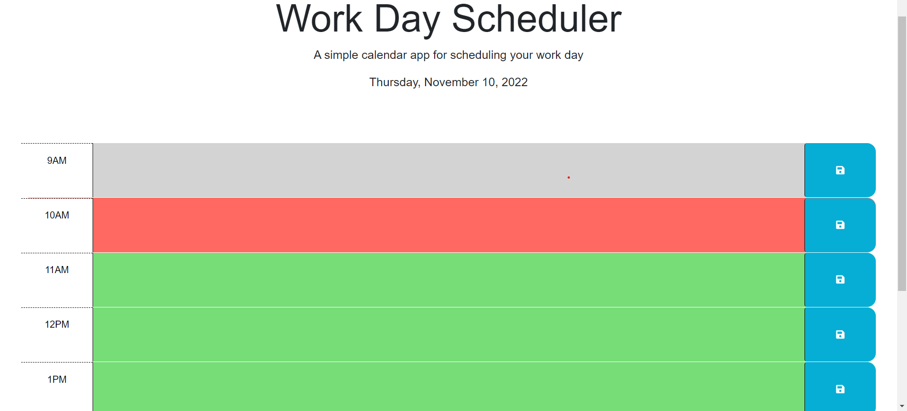
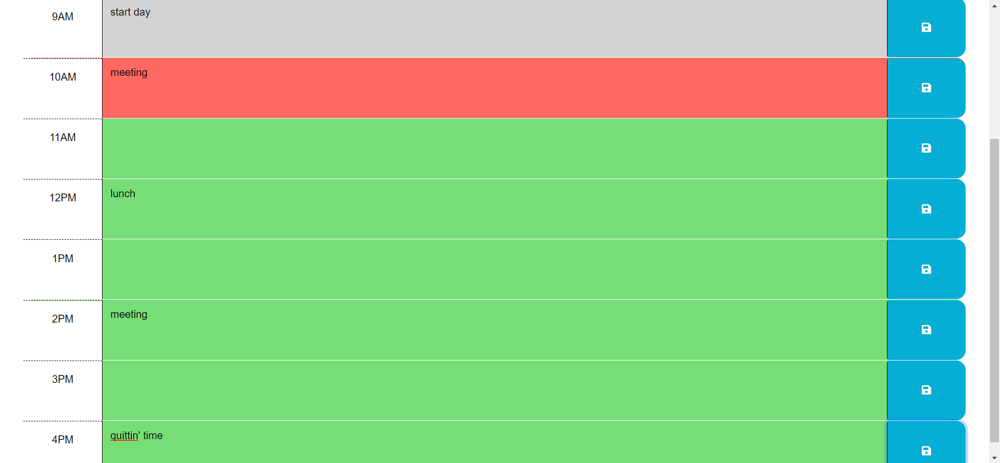
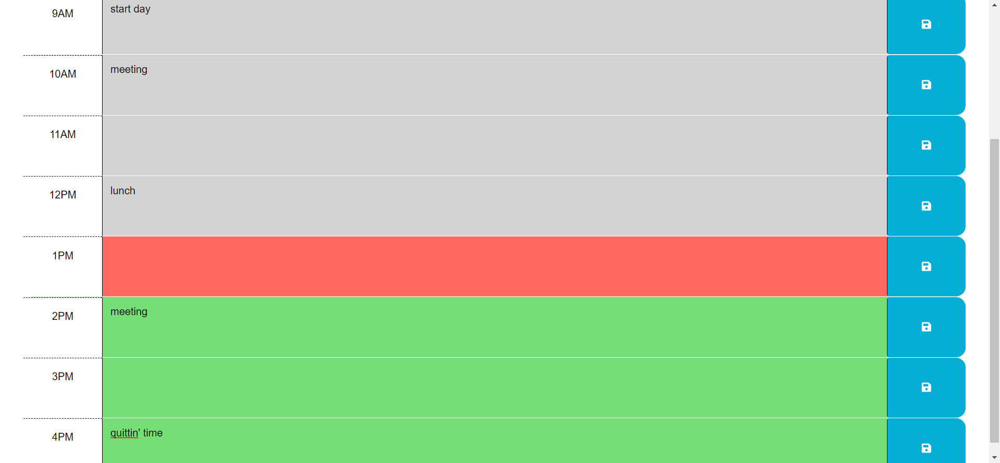

# Work-Day-Scheduler

## Description

A simple daily planner. You can schedule tasks that have to be at a specific time throughout the day and go back to it when you reload the page. 

## Table of Contents

- [Project-Links](#Project-Links)
- [Usage](#Usage)
- [Screenshots](#Screenshots)
- [Credits](#Credits)
- [License](#License)
- [Tests](#Tests)

## Project-Links

 - [Work-Day-Scheduler](https://hvansalisbury.github.io/Work-Day-Scheduler/)
 - [Github-Repository](https://github.com/hvansalisbury/Work-Day-Scheduler)

## Usage

When you load the page, you will see the current date at the top.

You will also see a block for each hour with a save button at the end.

Each hour will allow you to type in task scheduled for that specific hour. When you click on the save button, only that task will be saved so if you have tasks on other lines, they will not be saved until you click on the save button next to them.

When you reload the page, the saved tasks will appear where they were saved.

Additionally, each hourly block is color coded to represent past, present, and future hours. If the hour changes, the color coding will update itself.

## Screenshots

## Credits

 - [Github](https://github.com/hvansalisbury/Coding-Quiz-Challenge)
 - [Stack Overflow](https://stackoverflow.com)
 - [W3 Schools](https://www.w3schools.com/)
 - [Mozilla Developer Network](https://developer.mozilla.org/en-US/)
 - [Geeks for Geeks](https://www.geeksforgeeks.org)
 - The terrific instructor and TAs at the Rutgers Coding Bootcamp.

## License

 - [MIT License](https://choosealicense.com/licenses/mit/)

## Tests

To test the page, try typing in tasks to any hour block. If you refresh the page, the task will not be there. However, if you type in text to every block, and click save only on a few hours, only the tasks for those hours will be saved. Each save button is only responsible for the hour block it is in line with. You can also erase the text and click save to find the text is missing upon refresh.

To test the color coding, load the page during an hour and make sure the past hours are all 1 color, the future hours are all a different color, and the present hour is a third color. if you wait around for the hour to change, the color coding will adjust itself accordingly.